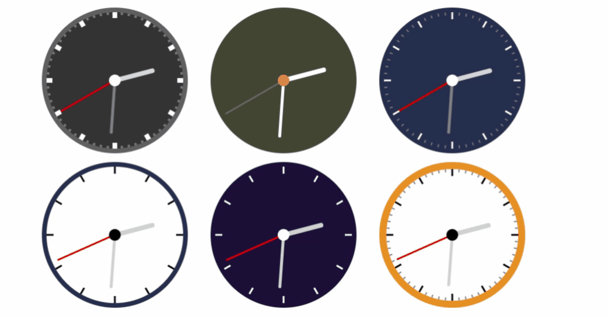

# React-Analog-Clock

React analog clock is a customizable analog clock component build using React. It provides an easy way of adding a clock for your application. It is customizable by passing properties to the component.

<p align="center">
  
</p>


## Demo

[Online demo](https://anaoktaa.github.io/react-analog-clock/) is available!

## Installation

```bash
$ npm install
$ npm start
```

### Usage

```js
import React from 'react';
import AnalogClockContainer from './components/analog-clock-container/analog-clock-container.component';
import './App.css';

const App = () => {
    return (
        <div className='app-container'>
            <div className='clock-container'>
                <AnalogClockContainer
                    size={250}
                    borderWidth={0}
                    hourHandWidth={8}
                    minuteHandWidth={5}
                    backgroundColor={'#444434'}
                    borderColor={'#444434'}
                    secondHandColor={'#676757'}
                    centerNodeColor={'#ee864a'}
                    hourHandColor={'white'}
                    minuteHandColor={'white'}
                    renderMinuteMarks={false}
                    renderHourMarks={false}
                />
            </div>
        </div>
    )
};

export default App;
```

#### Available Props

|Prop name|Description|Default value|Example values|
|----|----|----|----|
|className|Class name(s) that will be added along with `"react-clock"` to the main React-Clock `<time>` element.|n/a|<ul><li>String: `"class1 class2"`</li><li>Array of strings: `["class1", "class2 class3"]`</li></ul>|
|hourHandLength|Hour hand length, in %.|`50`|`80`|
|hourHandOppositeLength|The length of the part of an hour hand on the opposite side the hand is pointing to, in %.|`10`|`20`|
|hourHandWidth|Hour hand width, in pixels.|`4`|`3`|
|hourMarksLength|Hour marks length, in %.|`10`|`8`|
|hourMarksWidth|Hour marks width, in pixels.|`3`|`2`|
|minuteHandLength|Minute hand length, in %.|`70`|`80`|
|minuteHandOppositeLength|The length of the part of a minute hand on the opposite side the hand is pointing to, in %.|`10`|`20`|
|minuteHandWidth|Minute hand width, in pixels.|`2`|`3`|
|minuteMarksLength|Minute marks length, in %.|`6`|`8`|
|minuteMarksWidth|Minute marks width, in pixels.|`1`|`2`|
|renderHourMarks|Whether hour marks shall be rendered.|`true`|`false`|
|renderMinuteHand|Whether minute hand shall be rendered.|`true`|`false`|
|renderMinuteMarks|Whether minute marks shall be rendered.|`true`|`false`|
|renderNumbers|Whether numbers shall be rendered.|`false`|`true`|
|renderSecondHand|Whether second hand shall be rendered.|`true`|`false`|
|secondHandLength|Second hand length, in %.|`90`|`80`|
|secondHandOppositeLength|The length of the part of a second hand on the opposite side the hand is pointing to, in %.|`10`|`20`|
|secondHandWidth|Second hand width, in pixels.|`1`|`2`|
|size|Clock size, in pixels.|`150`|`250`|
|value|Clock value. Must be provided.|n/a|Date: `new Date()`|

